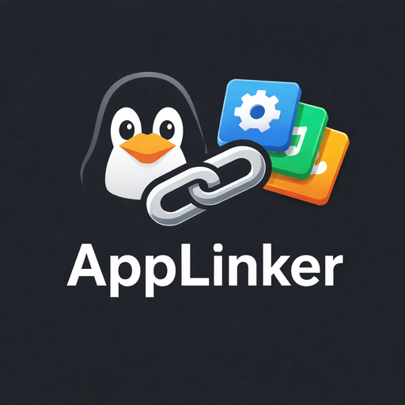
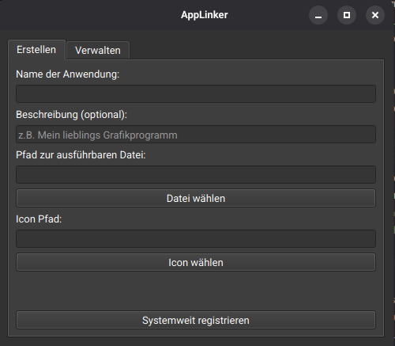

# AppLinker 🚀

<p align="center">
  
</p>

<p align="center">
  
  
  
</p>


**AppLinker** is a lightweight GUI tool built with Python and PyQt6, designed to seamlessly integrate AppImage files (and other executables) into Linux desktop environments. It automatically creates `.desktop` entries so your apps appear in your application menu, feature proper icons, and can be pinned to your dock.

### 📸 Screenshot
<p align="center">
  
</p>

## Features
- ✨ **Clean Integration:** Creates standard `.desktop` starters in `/usr/share/applications/`.
- 🖼️ **Icon Support:** Easily attach custom icons, automatically stored in `/usr/share/pixmaps/`.
- 📂 **User-Friendly:** Simple file selection via GUI dialogs.
- 🛠️ **Auto-Permissions:** Automatically makes files executable for you.
- 🧹 **App Management:** A dedicated "Manage" tab to list, refresh, and **cleanly uninstall** your created links (including icons).
- 🐧 **Desktop Ready:** Built for modern Linux environments (GNOME, KDE, XFCE, etc.).

## 🗺️ Roadmap
- [ ] **Automatic Metadata Extraction:** Extract icons and descriptions directly from AppImage internal files.
- [ ] **Auto-Update Check:** Notify users when a new version of AppLinker is available on GitHub.
- [ ] **Desktop Environment Detection:** Enhanced "Unlink" logic for various dock systems.

## Usage (AppImage)

The easiest way to use AppLinker is by downloading the pre-built AppImage:

1. **Download:** Get the latest version from the [Releases](https://github.com/HrSkully/AppLinker/releases) page.
2. **Make it Executable:** Right-click the file -> Properties -> Permissions -> "Allow executing file as program" (or via terminal: `chmod +x AppLinker-x86_64.AppImage`).
3. **Launch:** Double-click and start linking!

> **Note:** Since AppLinker creates system-wide starters, it will ask for your password (`pkexec`) to obtain write permissions for `/usr/share/applications/`.

## For Developers (Source Code)

If you want to run the tool from source or contribute to the project:

### 1. Clone the Repository
```bash
git clone [https://github.com/HrSkully/AppLinker.git](https://github.com/HrSkully/AppLinker.git)
cd AppLinker
```

### 2. Install Dependencies
Ensure you have Python installed, then run:
```bash
pip install PyQt6
```

### 3. Run the Application
Launch the tool using the Python interpreter:
```bash
python core/main.py
```

## License
This project is licensed under the MIT License - see the [LICENSE](LICENSE) file for details.